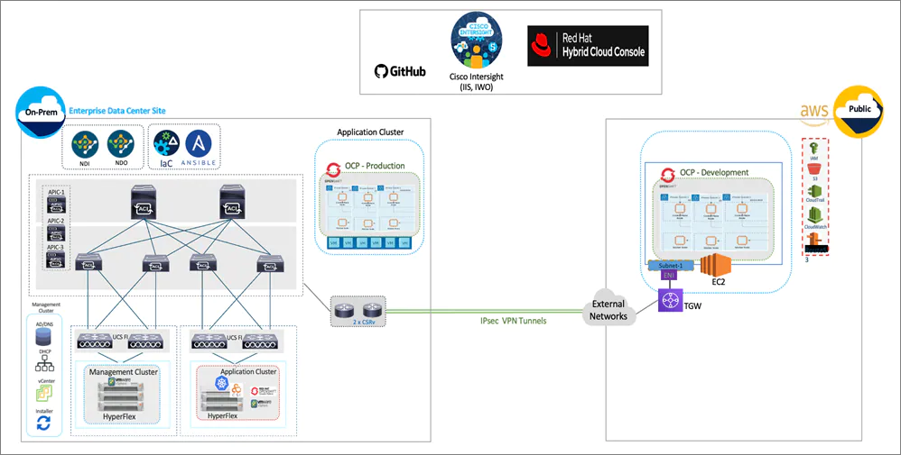
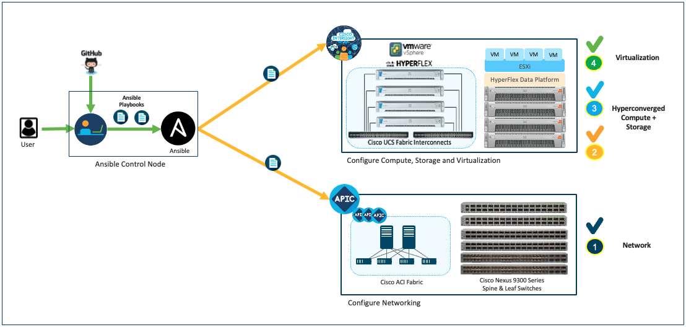
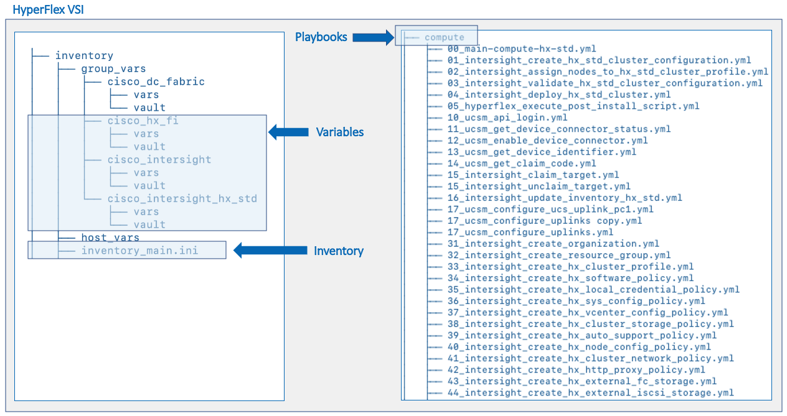
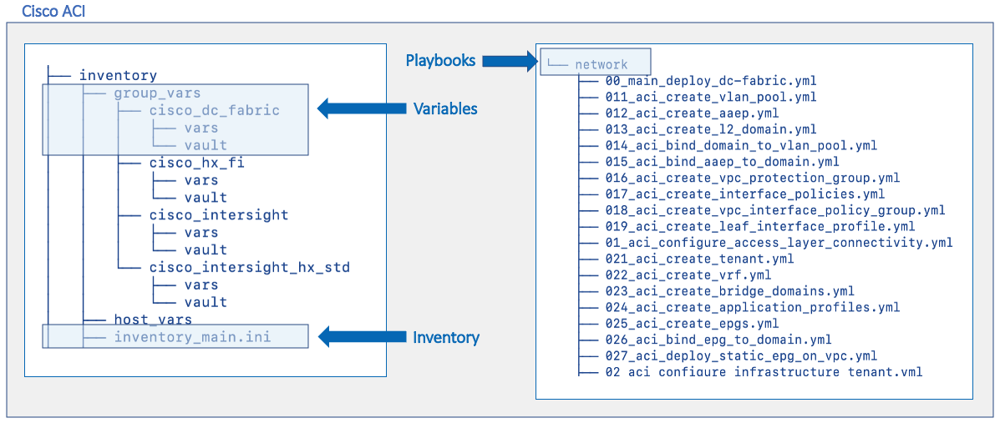

# Cisco Hybrid Cloud CVD - Cisco HyperFlex and Red Hat OpenShift Container Platform (OCP)

This repository contains the Ansible automation for provisioning the on-prem data center infrastructure in the above Cisco Validated Design. The design and deployment guide for the CVD is available at: https://www.cisco.com/c/en/us/td/docs/unified_computing/ucs/UCS_CVDs/hx_rh_ocp_hybrid_cloud.html

## Solution Topology
The end-to-end topology for the solution is shown in the figure below:

The Ansible playbooks provided in this repo will automate the on-prem compute, network and virtualization layer infrastructure in the solution. The playbooks will do the day-2 configuration necessary to support a new Application HyperFlex VSI and day0-1 provision of the HyperFlex VSI cluster. 

## Ansible Directory Structure - Playbooks, Inventory and Variables 
The playbooks, inventory files and variables for provisioning the on-prem infrastructure in the solution topology are located in the following files and directores:

### Cisco HyperFlex VSI

### Cisco ACI

