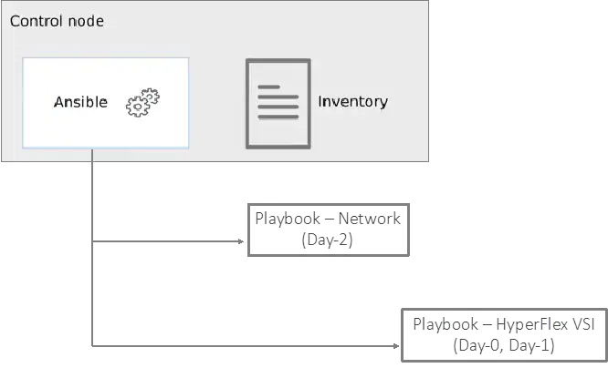

# Cisco Hybrid Cloud CVD - Cisco HyperFlex and Red Hat OpenShift Container Platform (OCP)

This repo provides the Ansible Automation for the above Cisco Validated Design. The design and deployment guide for this CVD is available at: https://www.cisco.com/c/en/us/td/docs/unified_computing/ucs/UCS_CVDs/hx_rh_ocp_hybrid_cloud.html
The Ansible playbooks provided here will automate the on-prem compute, network and virtualization layer infrastructure in the solution. 

The playbooks, inventory files and variables for the above infrastructure is located in the following files and directories:

* HyperFlex VSI Playbooks:  CVD_HC-OCP-HXFI/compute
* Networking Playbooks: CVD_HC-OCP-HXFI/network
* Inventory and Variables: CVD_HC-OCP-HXFI/inventory
  - Inventory file: inventory_main.ini
  - HyperFlex VSI Variables: group_vars/cisco_hx_fi, group_vars/cisco_intersight, group_vars/cisco_intersight_hx_std
  - Networking Variables: groups_vars/cisco_dc_fabric
